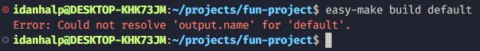

# easy-make JSON Specifications

This document explains the structure and fields of the easy-make JSON configuration file (`easy-make-configurations.json`).  
It serves as a complete reference for creating and customizing easy-make builds.

## 1. File Structure

The `easy-make-configurations.json` is composed of an array of object, where each project is a configuration.  
Each configuration must contain the following fields:

- `name`
- `compiler`
- `output.name`

## 2. Fields

- `name`:

  - Name of the configuration.
  - Must not be empty.
  - Example:
    ```json
    "name": "release"
    ```

- `parent`:

  - Name of parent configuration.
  - Value must be the name of another configuration.
  - The configuration uses the parent configuration's values as backup: If a field is not specified for the current configuration, it takes its parent value; if it is, the parent's value is overridden.
  - A parent configuration can have its own parent.
  - Example:
    ```json
    {
      "name": "base",
      "compiler": "g++",
      "optimization": "0",
      "output": {
        "name": "output.exe"
      }
    },
    {
      "name": "child",
      "parent": "base",
      "compiler": "clang++",
    }
    ```
    The second configuration has `clang++` as compiler, with `-O0` optimization level and its output will be called `output.exe`.

- `compiler`

  - C++ compiler.
  - Options:
    - g++
    - clang++
  - Example:
    ```json
    "compiler": "g++"
    ```

- `standard`

  - C++ standard.
  - Options:
    - "98"
    - "03"
    - "11"
    - "14"
    - "17"
    - "20"
    - "23"
    - "26"
  - Example:
    ```json
    "standard": "20"
    ```

- `warnings`

  - Compiler warning flags.
  - Warnings must start with `-W` and not be empty (just `-W` is outright invalid).
  - Example:
    ```json
    "warnings": ["-Wall", "-Wextra", "-Wpedantic"]
    ```

- `compilationFlags`

  - Additional compilation flags.
  - Example:

  ```json
  "compilationFlags": ["-pg", "-g"]
  ```

- `linkFlags`

  - Additional link flags.
  - Example:

  ```json
  "linkFlags": ["-pg", "-lm"]
  ```

- `optimization`

  - Compiler optimization flag. Equivalent to using `-O` with `g++`.
  - Options:

    <!-- - g++ and clang++ -->

    - "0"
    - "1"
    - "2"
    - "3"
    - "s"
    - "fast"
    <!-- - cl
      - "d"
      - "1"
      - "2"
      - "3"
      - "s"
      - "x" -->

  - Example:
    ```json
    "optimization": "2"
    ```

- `defines`

  - Preprocessor defines. Equivalent to using `-D` with `g++`.
  - Example:
    ```json
    "defines": ["DEBUG=1, DEF_2"]
    ```

- `includeDirectories`

  - Directories in includes search path. Equivalent to using `-I` with `g++`.
  - Example:
    ```json
    "includeDirectories": [".", "source"]
    ```

- `sources`

  - files: list of files to compile.
  - directories: list of directories to recursively scan and include all source files within. Supports .cpp, .cc, .cxx files.
  - All paths are relative to the JSON file.
  - Duplicate files are allowed.
  - Example:
    ```json
    "sources": {
        "files": ["src/dir_1/file_1.cpp", "src/dir_2/file_2.cpp"],
        "directories": ["src/dir_3", "src/dir_4"]
    }
    ```

- `exclude`

  - `files`: list of files to exclude.
  - `directories`: list of directories to recursively exclude.
  - Exclusions take precedence over inclusions in sources.
  - Example:
    ```json
    "exclude": {
        "files": ["src/dir_1/file_1.cpp", "src/dir_2/file_2.cpp"],
        "directories": ["src/dir_3", "src/dir_4"]
    }
    ```

- `output`
  - Target executable information:
    - `name`: name of the executable (Mandatory).
    - `path`: path to put the executable, relative to the JSON file. If not specified, the executable is created at the root directory.
  - Example:
    ```json
    "output": { "name": "output.exe", "path": "build/release" }
    ```

## 3. Configurations

- **easy-make** supports several configurations in one `.json` file.
- Example:

  ```json
  [
    {
      "name": "default",
      "compiler": "g++",
      "warnings": ["-Wall", "-Wextra", "-Wpedantic"],
      "output": {
        "path": "build"
      }
    },
    {
      "name": "debug",
      "parent": "default",
      "optimization": "0",
      "output": {
        "name": "debug.exe"
      }
    },
    {
      "name": "release",
      "parent": "default",
      "optimization": "3",
      "output": {
        "name": "release.exe"
      }
    }
  ]
  ```

To compile a specific configuration, run `easy-make build <configuration-name>`.  
In this example, we can run `easy-make build debug` or `easy-make build release`.

Note that running `easy-make build default` is invalid as the configuration is incomplete (no value for `output.name`).  
Running this invalid command will cause the following error to be printed:

<picture>
  <source srcset="./assets/incomplete-config-error-dark.png" media="(prefers-color-scheme: dark)">
  <source srcset="./assets/incomplete-config-error-light.png" media="(prefers-color-scheme: light)">
  
</picture>
